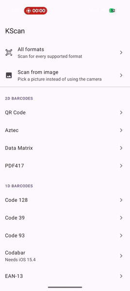
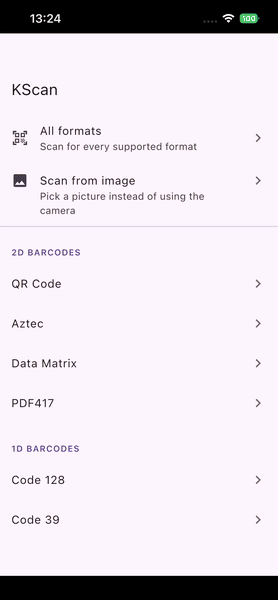
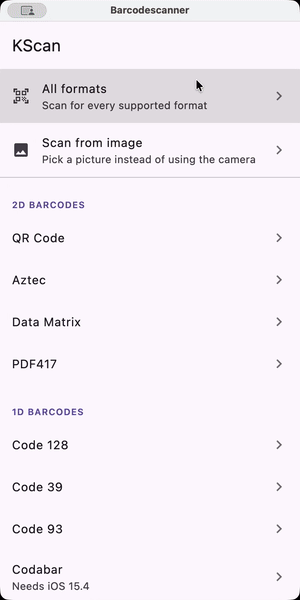
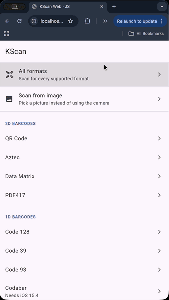
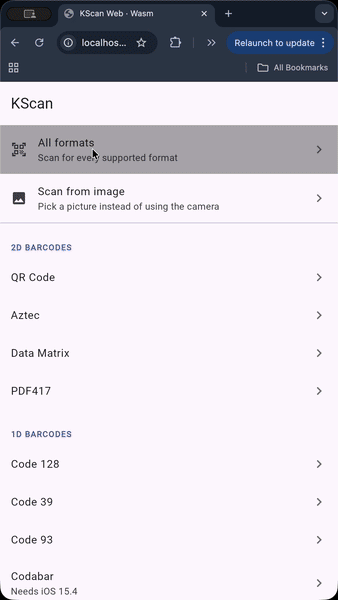

# KScan

[](https://opensource.org/licenses/Apache-2.0)
[](https://github.com/ismai117/KScan/releases/latest)

A Compose Multiplatform barcode scanning library for Android, iOS, Desktop and Web.

| Android | iOS | Desktop |
|---------|-----|---------|
|  |  |  |

| Web (JS) | Web (Wasm) |
|----------|------------|
|  |  |

## Installation

Add the dependency to your `commonMain` source set:

```kotlin
implementation("io.github.ismai117:KScan:$version")
```

## Platform Setup

**Android** - Uses [zxing-cpp](https://github.com/zxing-cpp/zxing-cpp) for barcode scanning, so every
dependency is open source and the library can be used in apps published on F-Droid.

**iOS** - Uses AVFoundation for camera and barcode scanning. 

**Windows / macOS / Linux** - Uses JavaCV for camera and ZXing for barcode scanning.

**Web (JS / Wasm)** - Uses the browser's
[BarcodeDetector](https://developer.mozilla.org/docs/Web/API/BarcodeDetector), falling back to the
MIT-licensed [barcode-detector](https://github.com/Sec-ant/barcode-detector) polyfill from a CDN
where a browser has none. `KScanWeb` points it at your own copies instead.

## Permissions
**Android, iOS, macOS** - Before displaying the `ScannerView`, your application must request and be granted camera permissions by the operating system. On iOS & macOS, add this to your `Info.plist`:

```xml
<key>NSCameraUsageDescription</key>
<string>Camera access is required for barcode scanning</string>
```

**Web** - The browser asks on the first scan, so there is nothing to declare, but the page has to be
served over https. Without it the browser withholds `getUserMedia` and no camera opens.

## Usage

### Basic

`ScannerView` draws the camera preview and nothing else, so the controls and overlays around it are
yours to build:

```kotlin
ScannerView(
    codeTypes = listOf(BarcodeFormat.FORMAT_QR_CODE, BarcodeFormat.FORMAT_EAN_13)
) { result ->
    when (result) {
        is BarcodeResult.OnSuccess -> {
            println("Barcode: ${result.barcode.data}")
        }
        is BarcodeResult.OnFailed -> {
            println("Error: ${result.exception.message}")
        }
    }
}
```

On web the preview is an HTML element the browser stacks above the Compose canvas, so place your own
UI beside it rather than over it.

### Custom Controls

Use `ScannerController` for torch and zoom:

```kotlin
val scannerController = remember { ScannerController() }

ScannerView(
    codeTypes = listOf(BarcodeFormat.FORMAT_ALL_FORMATS),
    scannerController = scannerController
) { result ->
    // handle result
}

// Torch control
Button(onClick = { scannerController.setTorch(!scannerController.torchEnabled) }) {
    Text("Toggle Torch")
}

// Zoom control
Slider(
    value = scannerController.zoomRatio,
    onValueChange = scannerController::setZoom,
    valueRange = 1f..scannerController.maxZoomRatio
)
```

### Scanning from Images

Use `scanImage` to scan barcodes from static images (gallery, screenshots, downloaded images) instead of the live camera feed:

```kotlin
scanImage(
    imageBytes = imageBytes, // ByteArray of the image (PNG, JPEG)
    codeTypes = listOf(BarcodeFormat.FORMAT_ALL_FORMATS),
    filter = { barcode -> true }, // Optional: filter detected barcodes
) { result ->
    when (result) {
        is BarcodeResult.OnSuccess -> {
            println("Barcode: ${result.barcode.data}")
            println("Format: ${result.barcode.format}")
        }
        is BarcodeResult.OnFailed -> {
            println("Error: ${result.exception.message}")
        }
    }
}
```

## Supported Formats

| 1D Barcodes | 2D Barcodes |
|-------------|-------------|
| CODE_128 | QR_CODE |
| CODE_39 | AZTEC |
| CODE_93 | DATA_MATRIX |
| CODABAR | PDF417 |
| EAN_13 | |
| EAN_8 | |
| ITF | |
| UPC_A | |
| UPC_E | |

Use `BarcodeFormat.FORMAT_ALL_FORMATS` to scan all supported types.

## License

```
Copyright 2024 ismai117

Licensed under the Apache License, Version 2.0 (the "License");
you may not use this file except in compliance with the License.
You may obtain a copy of the License at

http://www.apache.org/licenses/LICENSE-2.0
```

## Contributing

Contributions are welcome! Feel free to open issues or submit pull requests.
